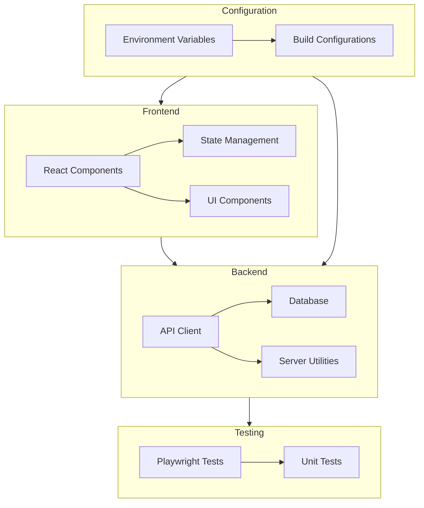

    

    <b>Automatic Architecture Diagrams from Code</b> 
    <a href="https://github.com/swark-io/swark">GitHub</a> • <a href="https://swark.io">Website</a> • <a href="mailto:contact@swark.io">Contact Us</a>

## Usage Instructions

1. **Render the Diagram**: Use the links below to open it in Mermaid Live Editor, or install the [Mermaid Support](https://marketplace.visualstudio.com/items?itemName=bierner.markdown-mermaid) extension.
2. **Recommended Model**: If available for you, use `claude-3.5-sonnet` [language model](vscode://settings/swark.languageModel). It can process more files and generates better diagrams.
3. **Iterate for Best Results**: Language models are non-deterministic. Generate the diagram multiple times and choose the best result.

## Generated Content
**Model**: GPT-4o - [Change Model](vscode://settings/swark.languageModel)  
**Mermaid Live Editor**: [View](https://mermaid.live/view#pako:eNptUstuwjAQ_BXLZ_iBHCqRhKdUCRXoxelhSZZk1cRGzpoKIf69JiGQCG6enfWMPbsXmZoMZSATnVs4FmIbJ1qI2u1bOLNGM-rsVhRior4QUhaRqY5Go-b6pyVCtWFgFJ-gIcfKM3ciUrvla_tEjMcfIuyD6AYao4F_COnvwz5Wk7VXK-mpP1UxMOyhxnthpjZoT2jFjqkkJuw848Zm2gez955brJl03nbO1bqE85-lvOCG6fQWaqdpWJo3qov3qpHRB8qdBSaj2_6lmuoT-YRvgYlvsAT78vHglQodldnwYkcuG6vVwKqbVRvuM7j7sSn3_jbQbfPoDfuVfSjKkazQVkCZ35tLIrnwE09kIBKZ4QFcyYm8-iZ3zPxOxAQ-gEoGbB2OJDg2m7NOO2yNywsZHKCs8foPEebVFA) | [Edit](https://mermaid.live/edit#pako:eNptUstuwjAQ_BXLZ_iBHCqRhKdUCRXoxelhSZZk1cRGzpoKIf69JiGQCG6enfWMPbsXmZoMZSATnVs4FmIbJ1qI2u1bOLNGM-rsVhRior4QUhaRqY5Go-b6pyVCtWFgFJ-gIcfKM3ciUrvla_tEjMcfIuyD6AYao4F_COnvwz5Wk7VXK-mpP1UxMOyhxnthpjZoT2jFjqkkJuw848Zm2gez955brJl03nbO1bqE85-lvOCG6fQWaqdpWJo3qov3qpHRB8qdBSaj2_6lmuoT-YRvgYlvsAT78vHglQodldnwYkcuG6vVwKqbVRvuM7j7sSn3_jbQbfPoDfuVfSjKkazQVkCZ35tLIrnwE09kIBKZ4QFcyYm8-iZ3zPxOxAQ-gEoGbB2OJDg2m7NOO2yNywsZHKCs8foPEebVFA)

