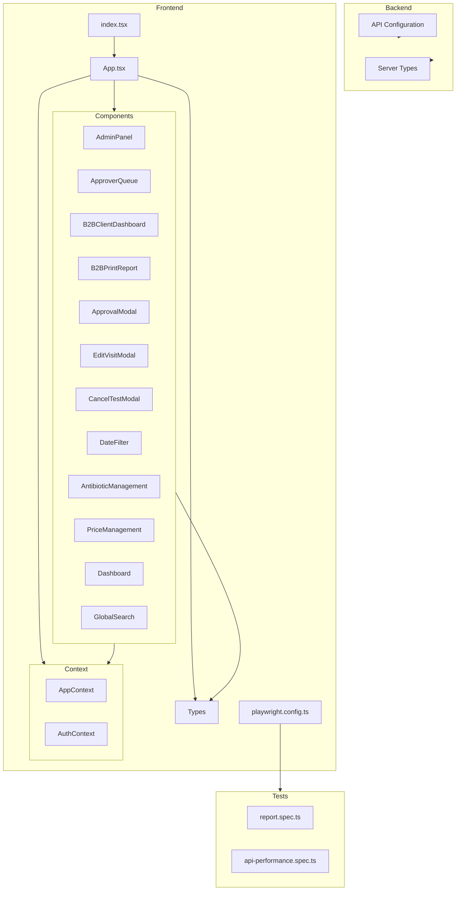

    

    <b>Automatic Architecture Diagrams from Code</b> 
    <a href="https://github.com/swark-io/swark">GitHub</a> • <a href="https://swark.io">Website</a> • <a href="mailto:contact@swark.io">Contact Us</a>

## Usage Instructions

1. **Render the Diagram**: Use the links below to open it in Mermaid Live Editor, or install the [Mermaid Support](https://marketplace.visualstudio.com/items?itemName=bierner.markdown-mermaid) extension.
2. **Recommended Model**: If available for you, use `claude-3.5-sonnet` [language model](vscode://settings/swark.languageModel). It can process more files and generates better diagrams.
3. **Iterate for Best Results**: Language models are non-deterministic. Generate the diagram multiple times and choose the best result.

## Generated Content
**Model**: GPT-4o - [Change Model](vscode://settings/swark.languageModel)  
**Mermaid Live Editor**: [View](https://mermaid.live/view#pako:eNp1VE1vozAQ_SvI54bDHnNYqWm2qx4qsU20F9PDBE_CaI1tGbubqOp_XwMGA90eIDNvXuZ7eGeVFsi2rFQXC6bOjvtSZVnrT4P6aLVyqEQHZtm9MTw8uWuvrwPypAReOXXvGfqgG6MVKtfyJE624PDqePyN6PFmsOX9OyKFhNtfS5faBeaZLtxMQF71SB599uktst5B9SclXTzx8GSDG2_BkVYxyAHtG9oh-CBnKYfPflMx0bVoSBWgUPIkvk69sjo4_OXRI19okbH7tnuQFLztoa1PGqzgn6HELSwp94JGW8eX6iIiyGctQPKFFhk_BLnf1JIbKEt1nA-oCuUR20ha6ZG1B4ePJB1ansQxD-XoRNpR9QwKLtiEevj_wHHSliqcUVf6FHFs0ro3P6U-gTwg2Krmc-XLKfabNzVt3MgkjoV4V0_GJH_htmtR3IthLAeDFbe9mLdBzqcbuDdUoD1r23TN7XlgaGMStvjDFCtkmG023-cVJGi-miPaL3MH9HfaQ8HUAYm_9riyTC7WBzlYx6K7C-uA2enNjmtpYneswVAnifDheS-Zq8OgS7bNSibwDF66kn0Ekjci7NaeIDS4YVtnPd4x8E4fbqoadav9pWbbM8gWP_4BngiwgQ) | [Edit](https://mermaid.live/edit#pako:eNp1VE1vozAQ_SvI54bDHnNYqWm2qx4qsU20F9PDBE_CaI1tGbubqOp_XwMGA90eIDNvXuZ7eGeVFsi2rFQXC6bOjvtSZVnrT4P6aLVyqEQHZtm9MTw8uWuvrwPypAReOXXvGfqgG6MVKtfyJE624PDqePyN6PFmsOX9OyKFhNtfS5faBeaZLtxMQF71SB599uktst5B9SclXTzx8GSDG2_BkVYxyAHtG9oh-CBnKYfPflMx0bVoSBWgUPIkvk69sjo4_OXRI19okbH7tnuQFLztoa1PGqzgn6HELSwp94JGW8eX6iIiyGctQPKFFhk_BLnf1JIbKEt1nA-oCuUR20ha6ZG1B4ePJB1ansQxD-XoRNpR9QwKLtiEevj_wHHSliqcUVf6FHFs0ro3P6U-gTwg2Krmc-XLKfabNzVt3MgkjoV4V0_GJH_htmtR3IthLAeDFbe9mLdBzqcbuDdUoD1r23TN7XlgaGMStvjDFCtkmG023-cVJGi-miPaL3MH9HfaQ8HUAYm_9riyTC7WBzlYx6K7C-uA2enNjmtpYneswVAnifDheS-Zq8OgS7bNSibwDF66kn0Ekjci7NaeIDS4YVtnPd4x8E4fbqoadav9pWbbM8gWP_4BngiwgQ)

